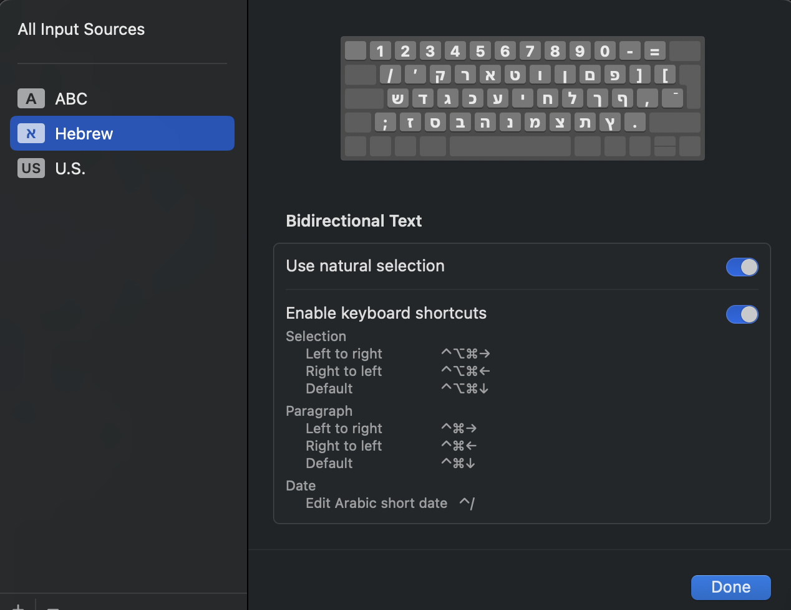

# Shortcuts

## Create a shortcut to App

## Hebrew

- Selection

  - Left to Right `Ctrl` + `Opt` + `Cmd` + `->`
  - Right to Left `Ctrl` + `Opt` + `Cmd` + `<-`
  - Default `Ctrl` + `Opt` + `Cmd` + `arrow down`

- Paragraph

  - Left to Right `Ctrl` + `Cmd` + `->`
  - Right to Left `Ctrl` + `Cmd` + `<-`
  - Default `Ctrl` + `Cmd` + `arrow down`

## Close Apps

- Close Window: `Cmd` + `W`
- Close Current App: `Cmd` + `Q`
- Force Quit Apps: `option` + `command` + `esc`
- Activity Monitor: `Cmd` + `Space`, type “Terminal”

## Finder

- Show Hidden Files: `Command` + `Shift` + `.` 

## Terminal

- Open app: `open -a app-name`